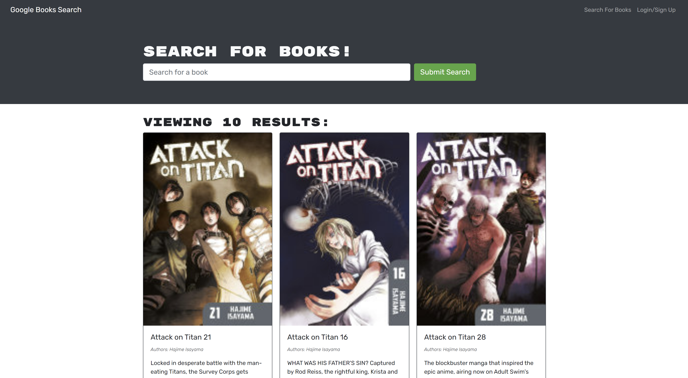

# Book Search Engine Refactor

## Table of Contents
  - [Description](#description)
  - [Installation](#installation)
  - [Usage](#usage)
  - [Visuals](#visuals)
  - [Credits](#credits)

## Description
[Link to deployed Heroku Site](https://book-search-engine-cdh.herokuapp.com/)\
The Book Search Engine was built using React, GraphQl, MongoDB, and Mongoose.\
It uses a google search api to find books that the user searches for.

## Installation
To install and test on your own computer first clone the repo\
Then in your terminal run `npm i` to install all dependencies\
Then run `npm run develop` to open a development server\
A live server will open on [http://localhost:3000](http://localhost:3000)

## Usage
You can search any book you want but in order to save books you must be logged in.\
There is a button to create an account on the top right of the page\
When you search for a book you while logged in you can save it with the button at the bottom of each book.\
To see your saved books go to the saved books page which you can then delete books from your list.

## Visuals
Book Search

Saved Books

## Credits
[Christian Hoffman](https://github.com/Christian-Hoffman)

The original code that was then refactored\
[Original code](https://github.com/coding-boot-camp/solid-broccoli)